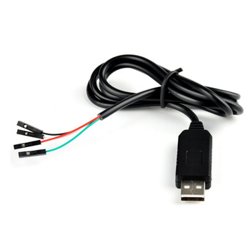

# node-serial-windows
 A Duplex stream interface for serial COM ports on windows

This tool can be used with this cable or any other serial connected to COM ports
over windows, expose a Duplex stream for write and read non-blocking on the port.

In the example, to show messages in console, connect the Tx cable to Rx and you get 
the echo messages line by line.